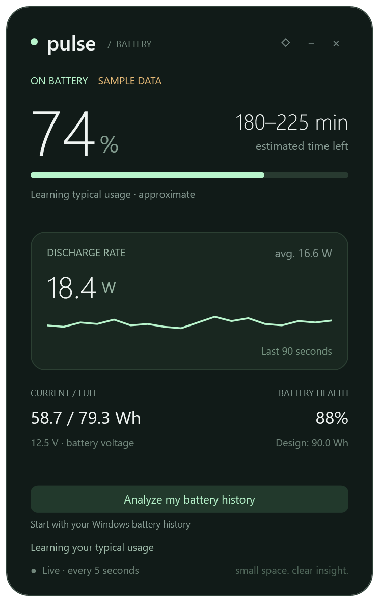

# Pulse 1.0.0

[Türkçe](README.md)

A compact battery widget for Windows 10/11 laptops, targeting .NET Framework 4.8. No installer, internet connection, additional packages or AI model required.

## Start and update

Extract `Pulse-v1.0.0-Windows.zip` and launch `Pulse.exe`. To update, exit the old copy from its tray menu and replace the executable. Desktop copies do not update automatically. Your learning profile is stored separately and is preserved. After a history-filter update, click **Reanalyze battery history**.

This release is unsigned; Windows may show an unknown-publisher warning. Cross-device field testing has not yet been completed.

## Language

Pulse detects the current Windows user's display language at startup. Turkish selects Turkish; English and other languages select English. Labels, menus, tooltips, status/error messages, time units and number formatting follow the selected language. Restart Pulse after changing the Windows display language. Optional overrides: `Pulse.exe --lang=tr` or `Pulse.exe --lang=en`.

## Controls and readings

- Drag the pulse title to move the window.
- ◇ / ◆ toggles always-on-top.
- − minimizes to the system tray; double-click the tray icon to restore.
- × or **Exit** closes the application.
- **Reset learning history** in the tray menu clears the local profile.
- Only one instance per Windows user/session is allowed.

Displays battery percentage, instantaneous discharge/charge power, a recent graph, approximate time remaining, current/full capacity, voltage and battery health when provided by the hardware.

## Live estimates and learning

### Screen-off and sleep isolation

Screen-off and suspend readings never train typical-use power, live smoothing, charging bands or the active graph. This protection is always enabled. Pulse subscribes to Windows session-display and suspend/resume notifications. Screen-off downloads are conservatively excluded too; screen-off is not presented as a definitive Modern Standby diagnosis. If notifications cannot be registered, live learning pauses with a status message.

The tray option **Show standby battery loss** defaults to on and is saved locally. When Windows allows the process to run, standby readings occur no more often than once per minute. Pulse does not request wake timers or prevent sleep. In-flight readings across state transitions are discarded; the first fresh wake reading is a boundary observation and active learning then starts fresh.

If valid boundary readings exist, the latest period shows approximate **net capacity loss in Wh** and duration, separate from learning. It lasts only for the current app session. Stale/missing starting data, battery changes or observed AC/charging suppress the result. Brief charging while the process is suspended may go unobserved: this is net change, not total energy consumed. Turning off the option disables standby tracking, never the learning exclusion.

`--standby-test` covers 19 isolation scenarios. `--powerwatch-test` checks native notification registration without sleeping the computer. A physical lid-close/Modern Standby cycle has not been exercised by the automated checks.

Readings arrive every 5 seconds. A seven-reading median and smoothing suppress short spikes while adapting to sustained load after roughly 20 seconds. Sleep gaps, invalid readings and charge/discharge changes restart the live window. Saved learning is retained.

Without imported history, live estimates need about 30 seconds and the typical-use profile needs at least 20 valid one-minute summaries. These are minimum data requirements, not accuracy guarantees. Typical full-battery runtime is inferred from full capacity and typical power; it is not an average of complete discharge runs.

The displayed range is a heuristic allowance, not a statistically calibrated confidence interval: normally ±10%, ±25% for variable usage or initial history estimates, and ±20% for an incompletely learned charge curve. Bounds are rounded outward to five minutes. The graph and “avg.” use raw readings, so their average need not match the smoothed estimate exactly.

Charging is learned in ten 10-percentage-point bands, requiring three minutes of observations per band. Remaining band durations are summed; unobserved bands use current power and remain marked as learning. Current power scales the historical curve to adapt to load/charger changes. Chargers are not stored separately. Firmware charge limits such as 80% are not detected. The target is reported full capacity, and stopped charging shows no charge ETA.

## Analyze battery history

**Analyze my battery history** creates a fresh Windows XML battery report for the last 14 days, in the background. It reads existing Windows records; it is not a battery stress test. The command runs only when requested, with a 30-second timeout. The temporary report is deleted after analysis; only summary statistics are saved.

Only active, battery-powered sessions are used. Sleep/AC entries, sessions shorter than five minutes or longer than 12 hours, stale or inconsistent data, duplicate/overlapping rows and nonpositive drains are excluded. Windows-marked battery replacement cuts off older history.

Outlier detection gives each session an equal vote, so one long gaming session during an outage cannot define normal use. The threshold uses the median and median absolute deviation, and never accepts a deviation greater than the median. Sessions above twice typical power are therefore excluded from the general profile. Retained-session averages use duration weights capped at 60 minutes. This detects unusual consumption, not games or electricity outages. Consistently high use can legitimately become the user's normal profile.

At least three retained sessions, 60 minutes and two UTC dates are required. Otherwise, live learning continues. Importing again replaces the summary rather than duplicating readings. The summary seeds the initial runtime, then live measurements take over. For typical-use estimates, imported history has a weight equivalent to 30 live minutes; its influence declines as live data grows. Imports older than 30 days expire.

Windows history describes the device and can include other Windows user sessions. It does not supply a sufficiently detailed charging curve for this implementation; charging continues to learn from live readings.

## Local data and resource limits

The profile is stored at `%LOCALAPPDATA%\Pulse\profile-v1.xml` for each Windows user. It contains at most 720 minute summaries from the last 30 days, 10 charging bands and one history summary. Live smoothing holds 24 readings and the graph holds 60. Data is saved at most every two minutes, plus exit/reset/import. No continuous raw log, application-name collection, upload, startup registration or power-setting change is performed.

An unreadable profile starts fresh; failed saves are reported. A changed Windows battery device identity resets the profile. A physical replacement retaining the same identity may require a manual reset. Window position and always-on-top preference do not persist between runs.

Missing hardware values display “—”. Relative-capacity drivers have not been validated. Opposing charge/discharge directions across multiple batteries disable power/ETA reporting. Battery health reflects manufacturer-reported full/design capacities.

## Build and checks

Run `build.ps1` to compile the included C# and XAML sources using Windows' .NET Framework compiler. `Localization.cs` contains the language dictionary and `AssemblyInfo.cs` the version metadata.

- `--self-test`: basic time calculations.
- `--learning-test`: 24 checks covering smoothing, sustained load, charging, persistence and bounded history.
- `--history-test`: 16 checks including rare gaming/outage drains and insufficient retained data.
- `--language-test`: Turkish, English and unsupported-language fallback, numbers and units.
- `--preview --lang=en` / `--preview --lang=tr`: render sample-data previews.
- `--probe`: write current readings to `probe.txt`.

Behavioral tests passed in both languages; the history generation/analysis path was verified on the development laptop. Synthetic checks do not prove field accuracy or whole-application CPU/RAM consumption. Generated test/probe files and personal battery reports are excluded from the release package.

Windows references: [Battery report command](https://learn.microsoft.com/en-us/windows-hardware/design/device-experiences/powercfg-command-line-options#batteryreport), [battery status](https://learn.microsoft.com/en-us/windows/win32/api/batclass/ns-batclass-battery_wmi_status).
