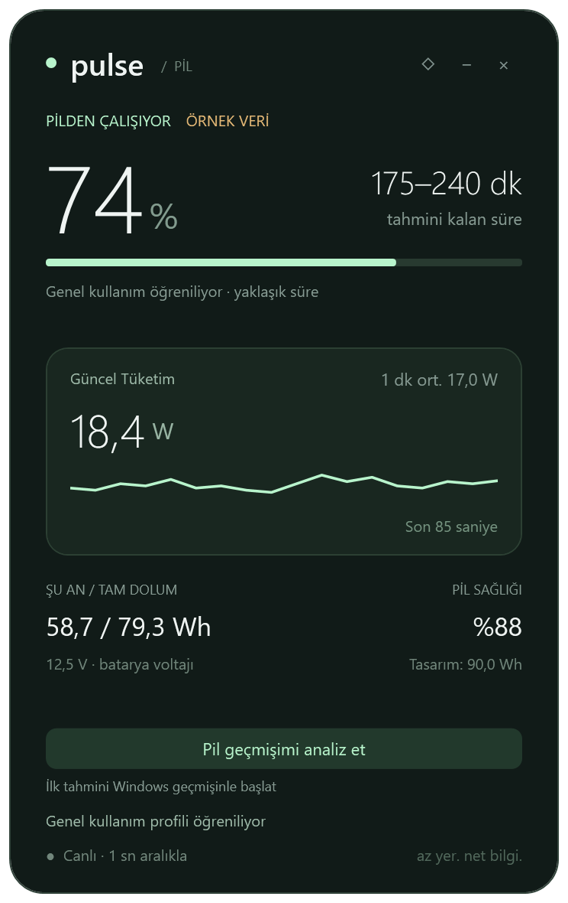

# Pulse 1.1.0-beta.1

[English](README.md)

Windows 10/11 laptoplar için C# ve WPF ile yazılmış küçük bir pil widget’ı. .NET Framework 4.8 kullanır; kurulum, internet, NuGet paketi veya yapay zekâ modeli gerektirmez.

## Başlatma ve güncelleme

Eski Pulse’u tepsi menüsünden kapatın, Windows ZIP’ini açın ve `Pulse.exe` dosyasını çalıştırın. Yeni bir kopya, başka klasördeki veya açık olan kopyayı kendiliğinden güncellemez. Beta imzasızdır; Windows bilinmeyen yayıncı uyarısı gösterebilir.

Profil `%LOCALAPPDATA%\Pulse\profile-v1.xml` konumunda kalır. Dosya adı korunmuştur, içindeki biçim artık sürüm 2’dir. İlk geçişte `profile-v1.xml.v1.bak` yedeği alınır. Eski uygulama yeni biçimi okuyamaz; geri dönmek için Pulse’u kapatıp bu yedeği elle geri yükleyin. Kişisel profilleri ve pil raporlarını yayın paketine koymayın.

Yeni Windows pil kimliği eski WMI kimliğinden daha ayrıntılıdır. Kimlik değiştiğinde ayrı bir model başlatılır; eski arşiv korunur. Böylece farklı olabilecek pillerin ölçümleri karışmaz. Windows geçmişini yeniden analiz ederek yeni modeli başlatabilirsiniz.

## Görünen bilgiler ve kullanım

Yüzde, güncel pil tüketimi/net şarj gücü (son 5 saniyedeki okumaların ortalaması), son beş dakikanın grafiği, yaklaşık kalan süre, mevcut/tam/tasarım kapasitesi, voltaj ve pil sağlığı gösterilir. Bilgilerin bulunması donanıma bağlıdır. Pilin watt değeri prizden çekilen toplam güç değildir. Donanım, Pulse’un sorgulama hızından daha yavaş güncellenebilir.

Windows görüntüleme dili Türkçeyse Türkçe, diğer dillerde İngilizce açılır. Dil değişikliğinden sonra yeniden başlatın. İsteğe bağlı: `--lang=tr` veya `--lang=en`.

Başlıktan veya başlığın üstündeki boş kenardan sürükleyin; ◇/◆ ile üstte tutun, − ile tepsiye küçültün, × ile kapatın. Tepsi simgesine çift tıklayarak geri açın. Tepsi menüsünden bekleme kaybı gösterimini değiştirebilir ve öğrenmeyi sıfırlayabilirsiniz. Sıfırlama mevcut pilin etkin arşivini temizler; eski pillere ait ayrı arşivler ve geçiş yedekleri diskte korunur.

## Öğrenme kuralları

- **Genel kullanım:** yalnızca bilgisayar aktifken, prizden çıkarılmış pil tüketiminden öğrenilir. Prize bağlıyken pilin destek vermesi de genel ortalamaya katılmaz.
- **Gerçek enerji:** watt değerleri geçen süreyle ağırlıklandırılır. Kısa ama gerçek yüksek tüketimler harcanan enerjiden silinmez. Ekrandaki tahmin, ayrı bir 30 saniyelik ortanca ve zamana bağlı yumuşatma ile dengelenir. Sürekli yüksek kullanımda kalan süre yeni duruma uyum sağlar.
- **İstisnai yük:** temel kullanım öğrenildikten sonra çok yüksek tüketimler ayrı kaydedilir. Tek bir uzun oyun/elektrik kesintisi genel profili değiştiremez. Son yedi yeterince gözlenen günün en az beşinde yüksek kullanım tekrarlanırsa yeni alışkanlık sayılabilir. Pulse oyunun adını veya elektriğin neden kesildiğini bilemez; ilk ölçümlerin tamamı oyunsa ayrı bir normal kullanım henüz bilinemez.
- **Watt eksikse:** kapasite değişimi, pilin ölçüm hassasiyetini aşacak kadar biriktiğinde 1–5 dakikalık eğilimden yaklaşık güç bulunabilir. Sabit/sıfır değerlerden, ölçüm boşluklarından veya pil göstergesi düzeltmelerinden tüketim uydurulmaz.
- **Uyku/ekran kapalı:** genel kullanım ve şarj öğrenmesine katılmaz. Ekran kapalı indirmeler de temkinli olarak dışlanır. Sadece ekranın kısılması öğrenmeyi sıfırlamaz. Uyku, güç kaynağı değişimi ve bu sırada devam eden eski okumalar birbirinden ayrılır.
- **Bekleme kaybı:** istenirse yaklaşık net kapasite kaybı ayrı saklanır. Bilgisayar uyandırılmaz; arka plan servisi kurulmaz. Windows uygulamayı tamamen duraklatabileceğinden uykuda kesintisiz okuma vaat edilmez. Gözlenen bir priz bağlantısı o bekleme kaybı ölçümünü geçersiz kılar.

Genel profil için en az 20 dakika uygun veri veya Windows geçmişi gerekir. Tek bir günün ağırlığı sınırlıdır; yeni günler daha etkilidir. Anlık kalan süre genel profilden ayrı, mevcut kullanımı izler. Eski kayıtlar silinmez; çalışan model son 180 arşiv gününü belleğe alır.

## Şarj tahmini, %99 ve şarj sınırları

Şarj ölçümleri yalnızca şarj modelini geliştirir. Eğri %5’lik dilimler kullanır. Bir dilimin öğrenilmiş sayılması için en az üç gözlenmiş şarj oturumu ve üç dakika ölçüm gerekir. Aynı oturumdaki çok sayıda dakika, bağımsız şarj döngüleri gibi sayılmaz. Bilgisayarın kullanımı değiştikçe net şarj gücü süreye yansır. Kesintisiz tamamlanan yüzde dilimlerinin gerçek geçiş süresi de ölçülür; üç geçişten sonra kapasite artışı ve geçen süre eğriyi iyileştirir.

Şarj durmuşsa kalan dakika yerine **Prize bağlı · şarj edilmiyor** gösterilir. Bildirilen şarj gücü sıfır ve kapasite iki dakika boyunca sabitse şarj öğrenmesi ve geri sayım durur. Bu bekleme, son yüzdeyi doldurmanın çok uzun sürdüğü şeklinde öğrenilmez. Windows %100 bildirip şarjın durduğunu söylüyorsa **Şarj tamamlandı** yazılabilir. Bildirilen %99 değiştirilmez; açıklanamayan bir duraklama kesin %80 sınırı diye etiketlenmez.

Üreticilerin şarj sınırları için evrensel bir sorgu eklenmedi. Adaptöre özel eğriler ve gerçek tam şarj döngüleriyle süre kalibrasyonu sonraki geliştirmelerdir. Eğri net watt değerlerinden ve gözlenen tam dilim sürelerinden öğrenir; gelecekteki kullanım değişikliklerini bilemez.

## Windows pil geçmişi

**Pil geçmişimi analiz et**, her seferinde yeni bir geçici `powercfg /batteryreport /xml /duration 14` raporu üretir; eski batteryhealth dosyasını kullanmaz. Analizden sonra geçici rapor silinir. İnternete veri gönderilmez, pili zorlayan test yapılmaz.

Yalnızca aktif ve prizden çıkarılmış dönemler değerlendirilir. Uyku/Connected Standby, prizli kullanım, geçersiz kapasite farkları, tekrarlar ve çakışmalar dışlanır. Bitişik kısa parçalar aykırı değer filtresinden önce birleştirilir. En az üç uygun oturum, 60 dakika ve iki gün gerekir. Ortanca/MAD filtresi sıra dışı oturumları ayırır; süre ağırlığı sınırlandırılır.

Windows verisi başlangıç tahminidir. Yeterli canlı geçmiş oluşunca aynı dönemler ikinci kez ağırlıklandırılmaz. Yeniden analiz eski içe aktarımı değiştirir. Windows’un sakladığı ayrıntı değişebilir; 14 gün istemek 14 tam gün veri garantisi değildir. İçe aktarılan başlangıç tahmini 30 gün sonra eskir; **Pulse’un kendi arşivi 30 günde silinmez**.

## Depolama ve kaynak kullanımı

- Son 48 saatin ayrıntılı kayıtları bellekte tutulur ve günlük dosyalara eklenir. Dosyalar gün bazında temizlendiği için diskte biraz daha eski ham kayıtlar kısa süre kalabilir.
- Normal kullanım, yüksek yük, şarj ve bekleme için günlük enerji/süre toplamları süresiz korunur: `profile-v1.xml.days\<pil kimliği özeti>\`.
- Yalnızca değişen günlük özet ve küçük etkin model güvenli dosya değişimiyle yazılır. Bütün dakika geçmişi yeniden yazılmaz. Normalde iki dakikada bir ve çıkışta kaydedilir; ani kapanmada henüz kaydedilmemiş aralık kaybolabilir.
- Yarım kalmış son kayıt satırı atlanır. Günlük toplamlar bağımsız olduğundan satırların yeniden okunması enerjiyi iki kez saymaz.
- Eski v1 ortanca değerleri yaklaşık geçmiş olarak korunur; kaydedilmemiş ham enerji sonradan geri üretilemez.
- Windows’un doğrudan pil arayüzü birimleri, pil kimliğini ve önbelleğe alınan bilgileri kontrol eder. Göreli birimli pillerde W/Wh uydurulmaz. Doğrudan okuma yoksa WMI/temel durum sınırlı yedektir. Benzersiz kimlik verilmezse cihaz yolu, pil etiketi ve tasarım kapasitesi temkinli kimlik ayrımı sağlar.
- Pencere açıkken doğrudan okuma 1 saniye; tepside veya yedek okumada 5 saniyedir. Gizli pencerenin grafiği yeniden çizilmez. İzin verildiğinde bekleme okuması en sık dakikada birdir.

Testte bir günlük özet yaklaşık 0,5 KB idi: bir pil için dosya içeriği yılda yaklaşık 0,2 MB, ayrıca yakın geçmiş ve model. Dosya sisteminin ayırdığı gerçek alan daha büyük olabilir. WPF/.NET belleği, exe boyutundan çok daha büyüktür. Kısa ölçümler ve sınırları [doğrulama notlarında](VALIDATION.md) bulunur.

## Tahminin sınırları

Aralık yaklaşık bir tahmindir; istatistiksel güven garantisi değildir. Başlangıçta geniştir, değişken kullanımda genişler; beş dakikalık kapasite değişimine karşı gözlenen tahmin hatalarıyla daha da genişleyebilir. Kapasite ve watt aynı donanım kaynağından gelir. Kullanım değişen pencereler sabit kullanım hata kalibrasyonundan dışlanır. Tam dolum/tam boşalma süreleriyle uçtan uca doğruluk henüz sahada kalibre edilmedi.

Otomatik senaryolar ve gerçek pil okuması bir laptopta kontrol edildi. Gerçek kapak kapatma/açma, priz geçişleri, şarj sınırları, çok pilli donanım ve farklı marka laptoplarda saha testi gerekiyor. Bu sürüm betadır.

## Derleme ve kontroller

.NET Framework 4.8 bulunan Windows’ta `powershell -ExecutionPolicy Bypass -File .\build.ps1` çalıştırın. Derleme indirme yapmaz.

Kontroller: `Pulse.exe --learning-test`, `--history-test`, `--standby-test`, `--self-test`, `--language-test`, `--powerwatch-test`. Her işlemin bitmesini bekleyip çıkış kodunu kontrol edin; sonuç dosyaları exe yanına yazılır. `--preview --lang=tr/en` örnek görüntüyü, `--preview --idle` %99 bekleme durumunu üretir. `--probe` yerel pil bilgilerini yazar; yayın paketine eklemeyin. `--smoke-test` 70 saniyelik ekran dışında/gizli pencere testi yapar; ayrı `smoke-work` profili kullanır, gerçek kullanıcı profiline dokunmaz.

Henüz lisans seçilmedi. Deponun herkese açık olması tek başına açık kaynak lisansı sağlamaz.

Büyük Güncel Tüketim değeri beş saniyede bir, son beş saniyedeki okumaların ortalamasıyla yenilenir; arada sabit kalır. Başlangıçta ilk geçerli ölçümü gösterir. Küçük 1 dk ort. alanı son bir dakikadaki okumaların ortalamasıdır; ilk dakika dolana kadar mevcut okumalar kullanılır. Şarj gücünde de aynı gösterim uygulanır. Görünür pencerede doğrudan okuma ve öğrenme her saniye devam eder; grafik ham ölçümleri kullanır.
